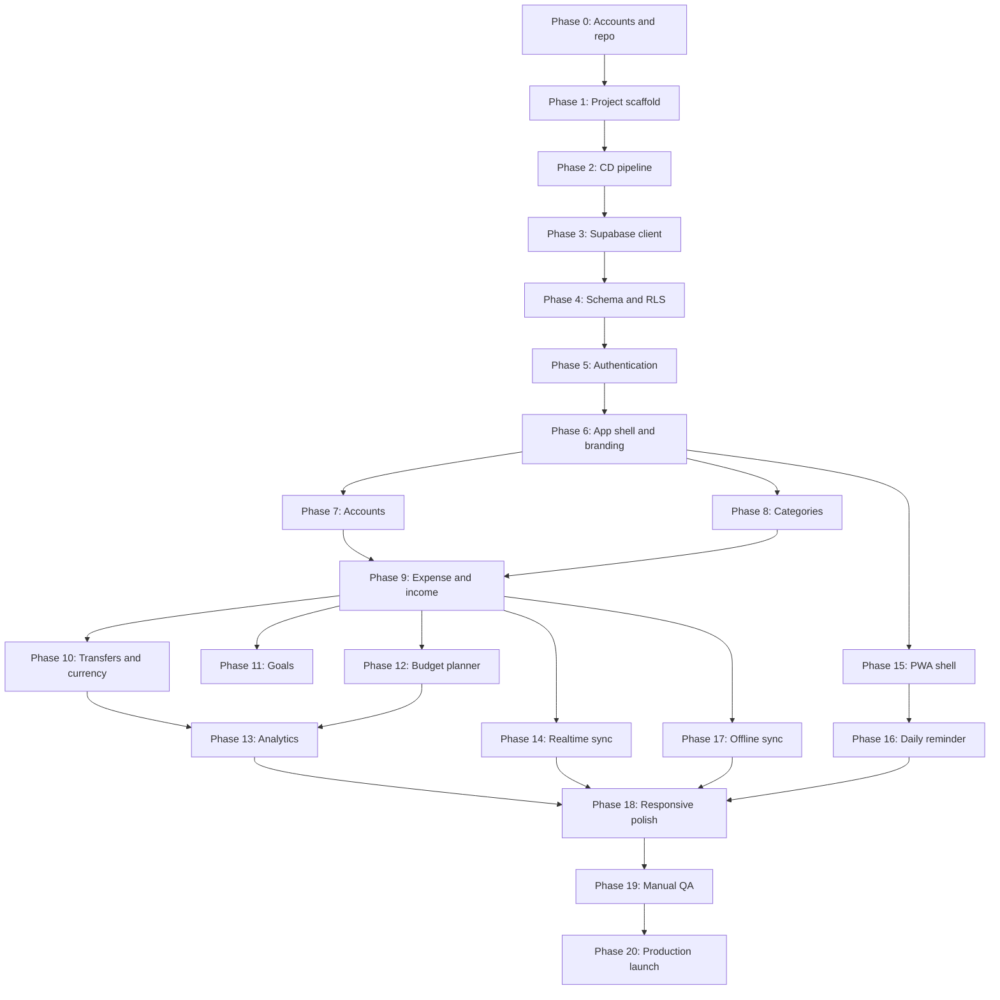

# Build Plan — Phase by Phase

## Personal Finance Tracker

**Version:** 1.0
**Status:** Draft
**Companion to:** `SRS-personal-finance-app.md`, `database-schema.md`
**Date:** August 29, 2026

---

## 0. How to Use This Document

This plan assumes a true from-scratch starting point:

- The local project folder exists but is otherwise empty.
- No package manager project has been initialized (no `package.json`).
- No GitHub repository exists yet.
- No Supabase project exists yet.
- No Vercel project exists yet.
- No Open Exchange Rates account exists yet.

Phases are ordered so that each one only depends on work completed in a prior phase, and are meant to be worked through sequentially. Each phase lists its **goal**, **prerequisites**, a **task checklist**, and a **definition of done**. Where relevant, tasks reference specific functional requirements (`FR-x.x`) from the SRS or table names from the schema doc, so implementation can be checked against those source documents.

**Confirmed technical decisions** (see prior conversation):

| Decision | Choice |
|---|---|
| Package manager | npm |
| Language | TypeScript |
| Framework | Next.js (App Router) |
| Styling | Tailwind CSS + shadcn/ui |
| Automated testing | Skipped for now — manual QA only |
| Backend | Supabase (Postgres, Auth, Realtime) |
| Hosting | Vercel |
| Currency data | Open Exchange Rates API |

**Phasing philosophy:** Get a deployable, connected pipeline (repo → Vercel → Supabase) working as early as possible with a trivial app, then layer in features from the ground up (auth → accounts → transactions → everything else), rather than building the whole frontend before touching the backend. Offline sync (FR-9.2–9.5) is deliberately placed late, consistent with the SRS calling it a "fast-follow" phase, not an MVP blocker.

---

## Phase 0 — Accounts, Tools, and Repository Setup

**Goal:** Every external service the project depends on exists and is reachable, before any code is written.

**Prerequisites:** None — this is the starting point.

**Tasks:**

- [ ] Install Node.js (LTS version, 20.x or newer) and confirm `npm` is available (`node -v`, `npm -v`).
- [ ] Install Git if not already present (`git --version`).
- [ ] Create a GitHub account (if one doesn't already exist).
- [ ] Create a new GitHub repository for this project (recommend private, given it will hold real financial-app configuration once secrets are involved — though secrets themselves should never be committed).
- [ ] Initialize Git in the existing local project folder (`git init`) and connect it to the new GitHub repository as the `origin` remote.
- [ ] Create a Supabase account (if one doesn't already exist) at supabase.com.
- [ ] Create a new Supabase project. Record and store somewhere safe (not in Git):
  - Project URL
  - `anon` public API key
  - `service_role` secret key (server-side only — never exposed to the browser)
- [ ] Create a Vercel account (if one doesn't already exist), ideally by signing in with the same GitHub account for easy repo linking.
- [ ] Create an Open Exchange Rates account at openexchangerates.org and sign up for the free (or appropriate) tier. Record the App ID.
- [ ] Add `SRS-personal-finance-app.md`, `database-schema.md`, and this file (`build-phases.md`) to the root of the local project folder, and commit them as the first commit — they serve as living context for all future work.

**Definition of done:** Local Git repo exists, is connected to GitHub, and contains the three planning `.md` files as its first commit. Supabase project, Vercel account, and Open Exchange Rates account all exist with credentials recorded somewhere safe.

---

## Phase 1 — Project Scaffold

**Goal:** A minimal, deployable Next.js app exists, with the core tooling (TypeScript, Tailwind, shadcn/ui) wired up.

**Prerequisites:** Phase 0 complete.

**Tasks:**

- [ ] Run `npx create-next-app@latest` inside the project folder, choosing: TypeScript, App Router, Tailwind CSS, ESLint. (If the folder already contains the `.md` files from Phase 0, run the scaffold command from within that folder rather than creating a new nested folder.)
- [ ] Confirm the app runs locally (`npm run dev`) and shows the default Next.js starter page.
- [ ] Initialize shadcn/ui (`npx shadcn@latest init`), configuring it to use the Tailwind setup already in place.
- [ ] Set up the base folder structure inside `src/`, e.g.:
  - `src/app/` — routes (App Router)
  - `src/components/` — shared UI components
  - `src/lib/` — utilities, Supabase clients, helpers
  - `src/types/` — shared TypeScript types
- [ ] Configure the Tailwind theme to include the project's color palette as named tokens (e.g. `lavender`, `periwinkle`, `dusty-rose`, `mauve`, `slate-purple`) mapped to the confirmed hex values (`#d8dcff`, `#aeadf0`, `#c38d94`, `#a76571`, `#565676`), so components can reference them semantically rather than as raw hex.
- [ ] Add a placeholder favicon/logo asset for the black pixel cat mascot (final art can come later — a simple placeholder unblocks layout work).
- [ ] Commit the scaffold and push to GitHub.

**Definition of done:** `npm run dev` runs a working Next.js + TypeScript + Tailwind + shadcn/ui app locally, with the color palette available as Tailwind tokens, committed and pushed to GitHub.

---

## Phase 2 — Continuous Deployment Pipeline

**Goal:** Every push to the main branch automatically deploys, and the pipeline is proven end-to-end before any real features exist — so later phases are never blocked debugging deployment issues alongside feature issues.

**Prerequisites:** Phase 1 complete.

**Tasks:**

- [ ] In Vercel, import the GitHub repository as a new project.
- [ ] Confirm Vercel auto-detects the Next.js framework and deploys successfully using default settings.
- [ ] Verify the deployed URL shows the same starter page as `localhost`.
- [ ] Confirm that a new commit pushed to the main branch triggers an automatic redeploy.

**Definition of done:** A live Vercel URL exists and reflects the current state of the `main` branch automatically on every push.

---

## Phase 3 — Supabase Client Integration

**Goal:** The Next.js app can talk to the Supabase project, both from the browser and from the server, using environment variables (not hardcoded keys).

**Prerequisites:** Phase 2 complete.

**Tasks:**

- [ ] Install `@supabase/supabase-js` and `@supabase/ssr`.
- [ ] Create `.env.local` (excluded from Git via `.gitignore`, which `create-next-app` sets up by default) containing:
  - `NEXT_PUBLIC_SUPABASE_URL`
  - `NEXT_PUBLIC_SUPABASE_ANON_KEY`
  - `SUPABASE_SERVICE_ROLE_KEY` (server-only, never prefixed with `NEXT_PUBLIC_`)
- [ ] Add the same environment variables to the Vercel project's settings (Production and Preview environments).
- [ ] Create Supabase client utility functions in `src/lib/supabase/` — one for browser/client-side use, one for server-side use (per `@supabase/ssr` conventions for the App Router).
- [ ] Write a temporary test page or API route that runs a trivial Supabase query (e.g. checking the connection) to confirm the client is correctly configured, both locally and on the deployed Vercel preview.
- [ ] Remove the temporary test page/route once confirmed working.

**Definition of done:** The app can successfully connect to Supabase from both a server context and a browser context, locally and in production, using environment variables.

---

## Phase 4 — Database Schema & Row-Level Security

**Goal:** Every table from `database-schema.md` exists in the Supabase Postgres database, with RLS enabled and enforced.

**Prerequisites:** Phase 3 complete.

**Tasks:**

- [ ] Write SQL migration(s) creating all tables per `database-schema.md` §4: `profiles`, `accounts`, `categories`, `transactions`, `goals`, `goal_contributions`, `budgets`, `budget_periods`, `exchange_rates` — including all columns, `CHECK` constraints, foreign keys (with the documented `ON DELETE` behavior), and indexes.
- [ ] Apply the unique constraint on `budget_periods (budget_id, period_start)`.
- [ ] Apply the transfer-related `CHECK` constraints on `transactions` (destination account required only for transfers; destination ≠ source).
- [ ] Enable RLS on every user-owned table and write the `user_id = auth.uid()` policy for each, per §4 of the schema doc.
- [ ] Set `exchange_rates` RLS to allow read access broadly but restrict writes to the service role only.
- [ ] Create a Postgres trigger (or Supabase Auth hook) that automatically inserts a `profiles` row whenever a new `auth.users` row is created, so every signed-up user has a corresponding profile without extra application code.
- [ ] Create a mechanism (function, or a one-time app-level check on first login) to seed a default set of categories for a new user, per FR-4.5 — content of the default list to be finalized during UI work in a later phase, a small placeholder list is fine for now.
- [ ] Run and verify all migrations against the Supabase project, and manually inspect the resulting tables/policies in Supabase Studio.

**Definition of done:** All tables exist in Supabase exactly as documented in `database-schema.md`, RLS is active on every table, and creating a test user via Supabase Auth automatically produces a `profiles` row and a set of default categories.

---

## Phase 5 — Authentication

**Goal:** A user can sign up, log in, log out, and reset their password; every other route requires a valid session.

**Prerequisites:** Phase 4 complete.

**Tasks:**

- [ ] Build sign-up, login, and logout flows using Supabase Auth (FR-1.1).
- [ ] Build a password reset flow.
- [ ] Add Next.js middleware that checks for a valid Supabase session and redirects unauthenticated users away from protected routes (FR-1.2, enforced at the app layer in addition to RLS at the database layer).
- [ ] Build a first-login onboarding step prompting the user to set their `base_currency` (FR-1.3), since `profiles.base_currency` has no default and is required by later multi-currency features.
- [ ] Test the complete loop — sign up, get redirected appropriately, log out, log back in — both locally and on a deployed Vercel preview.

**Definition of done:** A real user can complete the full authentication lifecycle on the deployed app, and no protected page is reachable without a valid session.

---

## Phase 6 — App Shell, Navigation, and Branding

**Goal:** The application has a consistent, responsive shell (navigation, layout, theming) that every subsequent feature will be built inside of.

**Prerequisites:** Phase 5 complete.

**Tasks:**

- [ ] Build the responsive navigation shell per FR-11.2: a sidebar (or similar) on desktop widths, and a bottom navigation bar or drawer on mobile widths, both giving access to the same set of destinations.
- [ ] Establish the route skeleton for the app's main sections (even as empty placeholder pages at this point): Dashboard, Accounts, Transactions, Categories, Goals, Budgets, Settings.
- [ ] Apply the color palette and mascot branding consistently across the shell (FR-11.3) — header, nav, buttons, using the Tailwind tokens set up in Phase 1.
- [ ] Confirm the shell itself (not yet the feature content) looks and behaves correctly at both a small mobile width and a full desktop width (FR-11.1).

**Definition of done:** Logging in lands the user in a branded, responsive shell with working navigation to empty placeholder pages for every core section.

---

## Phase 7 — Accounts

**Goal:** Users can fully manage their financial Accounts.

**Prerequisites:** Phase 6 complete.

**Tasks:**

- [ ] Build the curated icon set (~50–100 Lucide icons) as a reusable picker component.
- [ ] Build the Accounts list/overview page, showing each account's name, type, currency, and current balance (FR-2.4 — note: balance will start as a hardcoded 0.00 placeholder until Transactions are fully implemented in Phase 9).
- [ ] Build the "create account" flow: name, type, fixed currency (FR-2.1).
- [ ] Build the "edit account" flow: name, type, icon/color — currency remains non-editable by omission from the edit form (FR-2.2).
- [ ] Build the "archive account" flow (soft-delete), including hiding archived accounts from active views while keeping them queryable/restorable (FR-2.3).

**Definition of done:** A user can create, edit, and archive Accounts, and see them reflected correctly in a responsive list view.

---

## Phase 8 — Categories

**Goal:** Users can fully manage their transaction Categories, including the icon picker.

**Prerequisites:** Phase 6 complete (can be built in parallel with Phase 7).

**Tasks:**

- [ ] Build the Categories list page, grouped or filterable by transaction type (Expense/Income/Transfer).
- [ ] Build the "create category" flow: name, type, icon (FR-4.1, FR-4.2).
- [ ] Build the "edit category" flow: name, icon (FR-4.3).
- [ ] Build the "delete category" flow, blocking deletion with a clear message when the category is still referenced by any transaction (FR-4.4).
- [ ] Verify the default category seeding from Phase 4 appears correctly for a newly created user, and finalize the actual default list content/icons here (SRS open item, resolved as part of this phase).

**Definition of done:** A user can create, edit, and delete Categories (respecting the deletion-block rule), and new users see a sensible pre-seeded default set.

---

## Phase 9 — Transactions: Expense & Income (Single Currency)

**Goal:** The core transaction-logging loop works for Expenses and Income, before cross-currency complexity is introduced.

**Prerequisites:** Phases 7 and 8 complete.

**Tasks:**

- [ ] Build the "add expense" form: amount, category (filtered to expense-type categories), account, date, optional note (FR-3.1).
- [ ] Build the "add income" form: amount, category, account, date, optional note (FR-3.2).
- [ ] Build the transaction list/history view, filterable by account, category, and date range.
- [ ] Build "edit transaction" and "delete transaction" flows, recalculating the affected account's balance on either action (FR-3.4, FR-3.5).
- [ ] Wire up real account balances on the Accounts page (replacing the Phase 7 placeholder) using actual transaction data.

**Definition of done:** A user can log, edit, and delete Expense and Income transactions against any of their accounts, and account balances update correctly.

---

## Phase 10 — Transfers & Multi-Currency

**Goal:** Transfers work between accounts, including across different currencies, backed by real exchange rate data.

**Prerequisites:** Phase 9 complete.

**Tasks:**

- [ ] Implement the Open Exchange Rates fetch: a server-side function (e.g. a Vercel scheduled function/cron, or an on-demand check with a staleness threshold) that fetches current rates and stores them into the `exchange_rates` table, per FR-8.2.
- [ ] Implement a fallback path that uses the last successfully cached rate if a fresh fetch fails, and surfaces to the user that a rate may be stale (FR-8.4).
- [ ] Build a shared currency-conversion utility function used everywhere conversion is needed.
- [ ] Build the "add transfer" form: source account, destination account, amount — automatically computing and displaying the converted destination amount when currencies differ (FR-3.3, FR-8.1, FR-8.3).
- [ ] Extend edit/delete transaction flows to correctly handle transfers (adjusting both accounts' balances).

**Definition of done:** A user can transfer money between two accounts of different currencies, with the converted amount computed from real (or gracefully-degraded cached) exchange rate data.

---

## Phase 11 — Goals

> **⚠️ HALTED — This phase will not be developed yet.** The goals feature as designed (annotation-based contributions on income transactions) has an integrity problem: contributed amounts are not backed by actual separated funds, so goal progress can become misleading when the user spends money that was "allocated" to a goal. This phase is preserved here for future reference but is skipped in the current build sequence. A redesigned approach (e.g., account-linked goals) may be revisited post-v1.

**Goal:** Users can define savings Goals and allocate income toward them.

**Prerequisites:** Phase 9 complete (Income logging must exist).

**Tasks:**

- [ ] Build the Goals list page, showing each goal's name, target amount, target date, and progress.
- [ ] Build the "create goal" flow: name, target amount, optional target date — account-agnostic, per the resolved data model (FR-5.1).
- [ ] Extend the "add income" form from Phase 9 to optionally allocate all or part of the amount toward one or more Goals (FR-5.2), writing to `goal_contributions`.
- [ ] Enforce, at the application layer, that the sum of a transaction's contributions never exceeds its amount (per the schema doc's resolved decision).
- [ ] Build "edit goal" and "delete goal" flows, confirming that deleting a goal only removes the label and never touches underlying transactions (FR-5.4).
- [ ] Display goal progress as a rolled-up total independent of any single account (FR-5.3).

**Definition of done:** A user can create Goals and allocate income toward them from the income-logging flow, with correct progress tracking.

---

## Phase 12 — Budget Planner

**Goal:** The full weekly/monthly/custom budget system works, including lazy period generation and rollover.

**Prerequisites:** Phase 9 complete (spending data must exist to track against).

**Tasks:**

- [ ] Build the "create budget" flow: category, limit amount, period type (Weekly / Monthly / Custom with start+end date) (FR-6.1).
- [ ] Implement the lazy `budget_periods` generation logic: on viewing a budget, check whether a period row exists covering today; if not, generate one, computing `rollover_in` from the most recent prior period (per the schema doc's resolved decision on lazy generation).
- [ ] Implement the rollover calculation itself: `effective_limit = base_limit + rollover_in`, where a prior period's under/overspend carries forward dollar-for-dollar (FR-6.3).
- [ ] Build the budget progress view: spend vs. effective limit for the current period (FR-6.2).
- [ ] Build "edit budget" and "delete budget" flows, confirming edits only affect the current period forward, never past `budget_periods` rows (FR-6.4).
- [ ] Confirm multi-currency spend against a budget is correctly converted to base currency for display (FR-6.5).

**Definition of done:** A user can set up a weekly, monthly, or custom-period budget per category, see accurate rollover behavior across periods, and edit/delete budgets without corrupting historical data.

---

## Phase 13 — Analytics Dashboard

**Goal:** The dashboard gives a clear visual picture of spending, trends, and budget health.

**Prerequisites:** Phases 9, 10, and 12 complete.

**Tasks:**

- [ ] Build the category breakdown view (pie/bar chart), filterable by date range (FR-7.1).
- [ ] Build the trends-over-time view (line/area chart of income vs. expense), filterable by date range and account (FR-7.2).
- [ ] Build the budget-vs-actual view, showing progress per active budget including its rollover-adjusted limit (FR-7.3).
- [ ] Ensure every dashboard total is converted into the user's base currency using cached exchange rates (FR-7.4).
- [ ] Confirm the dashboard reflows correctly across mobile and desktop breakpoints (FR-7.5).

**Definition of done:** The dashboard presents category breakdowns, trends, and budget health, all correctly converted to base currency and usable on any screen size.

---

## Phase 14 — Realtime Multi-Device Sync

**Goal:** Changes made on one device while online appear live on another open, connected session, without a manual refresh.

**Prerequisites:** Phase 9 complete (there must be data worth syncing live).

**Tasks:**

- [ ] Set up Supabase Realtime subscriptions on the key tables a user might have open in two places at once — at minimum `transactions` and `accounts` (FR-9.6).
- [ ] Wire subscription updates into the app's data layer so that an open list/dashboard view updates itself when a Realtime event arrives, rather than requiring navigation or a manual refresh.
- [ ] Test with two simultaneous sessions (e.g. a desktop browser and a mobile browser, or two browser windows) to confirm live propagation.

**Definition of done:** Logging a transaction in one open session visibly and immediately updates another open session for the same user, without any manual action.

---

## Phase 15 — Progressive Web App (PWA)

**Goal:** The app is installable on both mobile and desktop, with the manifest and service worker foundation in place (ahead of full offline support in Phase 17).

**Prerequisites:** Phase 6 complete (a stable shell to install).

**Tasks:**

- [ ] Add a web app manifest (`manifest.json`) with the app's name, icons (including the pixel cat branding), theme color (drawn from the palette), and display mode.
- [ ] Add a basic service worker providing installability and simple asset caching (full transaction-queue offline logic comes in Phase 17 — this phase is about the installable shell, per FR-9.1).
- [ ] Test installation on a mobile device/browser and on a desktop browser, confirming the app launches in its own window/icon.

**Definition of done:** The app can be installed as a PWA on both a mobile device and a desktop browser.

---

## Phase 16 — Daily Reminder Notification

> **⚠️ HALTED — This phase will not be developed.** The feature was intended to use purely local/client-side scheduled notifications without a backend push server. However, progressive web apps (PWAs) are aggressively suspended by mobile operating systems (both iOS and Android) when closed or backgrounded. A purely client-side scheduled notification cannot reliably wake up a closed PWA to alert the user at a specific time. Because a push server is out of scope for v1, this feature is skipped.

**Goal:** Users get a local, user-configurable daily reminder to log their transactions.

**Prerequisites:** Phase 15 complete (requires the service worker/PWA foundation).

**Tasks:**

- [ ] Build a settings control for the user to set (and change) their preferred reminder time (FR-10.2).
- [ ] Implement the reminder using the browser Notification API and a client-side schedule check — no backend push infrastructure (FR-10.1, FR-10.3).
- [ ] Handle the notification permission flow gracefully, including the case where permission is denied or the platform doesn't support it (e.g. iOS Safari PWA constraints) (FR-10.4).

**Definition of done:** A user can set a reminder time in settings and reliably receives a local notification at that time, with permission edge cases handled without breaking the app.

---

## Phase 17 — Offline Support & Sync (Fast-Follow)

> **⚠️ HALTED / ROLLED BACK — This phase will not be developed.** Attempting to bolt a massive offline-first architecture (Dexie, full background sync, Client Components) onto an app that was fundamentally built as online-first (Next.js Server Components, Server Actions, direct Supabase queries) is an architectural mismatch. It causes major friction with routing and adds massive complexity for a feature that is out of scope for the current architecture. The app will remain strictly online-first.

**Goal:** Users can log transactions with no internet connection, and have them sync automatically once back online.

**Prerequisites:** Phase 9 complete. This phase is explicitly a fast-follow — it's fine (and expected) for it to start well after MVP features are live, per the SRS.

**Tasks:**

- [ ] Introduce a local-first data layer for transactions (e.g. IndexedDB via a lightweight wrapper library) so the transaction-entry form works fully offline (FR-9.2).
- [ ] Implement a sync queue: transactions created offline are marked unsynced and stored locally, tagged with `client_created_at`.
- [ ] Implement automatic sync-on-reconnect: when connectivity returns, queued transactions are pushed to Supabase and marked `synced_at` (FR-9.3).
- [ ] Implement last-write-wins conflict resolution for the rare case of the same record being edited on two devices while offline, based on `client_created_at` (FR-9.4).
- [ ] Test the full offline → reconnect → sync loop deliberately (e.g. using browser dev tools to simulate offline mode).

**Definition of done:** A user can log transactions with no network connection, and see them correctly and automatically synced once the connection returns, with no data loss.

---

## Phase 18 — Full Responsive & Branding Polish Pass

**Goal:** Every screen, not just the shell, is verified against the responsive and branding requirements.

**Prerequisites:** All feature phases (7–17) complete.

**Tasks:**

- [ ] Walk through every view built in Phases 7–17 at both a small mobile width and a full desktop width, fixing any layout issues (FR-11.1).
- [ ] Confirm the color palette and mascot branding are applied consistently across every screen, not just the shell (FR-11.3).
- [ ] Replace any placeholder mascot/logo assets from Phase 1 with final artwork, if ready.

**Definition of done:** Every screen in the app is fully usable and visually consistent on both mobile and desktop.

---

## Phase 19 — Manual QA Pass

**Goal:** Since automated testing was deliberately skipped, a deliberate manual pass substitutes for it before calling the app launch-ready.

**Prerequisites:** Phase 18 complete.

**Tasks:**

- [ ] Build a manual test checklist directly from the SRS's functional requirements (FR-1.x through FR-11.x), and work through each one on both a mobile device and a desktop browser.
- [ ] Specifically re-test edge cases known to be tricky: cross-currency transfers, budget rollover across multiple periods, offline-then-sync, goal contributions summing correctly, category deletion blocking, account archiving.
- [ ] Fix any bugs found before proceeding.

**Definition of done:** Every functional requirement in the SRS has been manually verified working correctly on both device classes.

---

## Phase 20 — Production Launch

**Goal:** The app is live in production and ready for real, everyday use.

**Prerequisites:** Phase 19 complete.

**Tasks:**

- [ ] Do a final review of all environment variables and secrets in Vercel's Production environment (Supabase keys, Open Exchange Rates App ID).
- [ ] Confirm the Supabase project is on an appropriate plan/tier for expected usage (especially relevant for Realtime and database size as data grows).
- [ ] Promote the current `main` branch build to Production in Vercel (or confirm it already auto-deploys there).
- [ ] Decide on and configure a custom domain, if desired (optional — not yet decided, can ship on the default Vercel URL first).
- [ ] Do a final smoke test directly against the production URL.

**Definition of done:** The app is live at its production URL, fully functional, and ready for daily personal use.

---

## Appendix: Phase Dependency Overview

