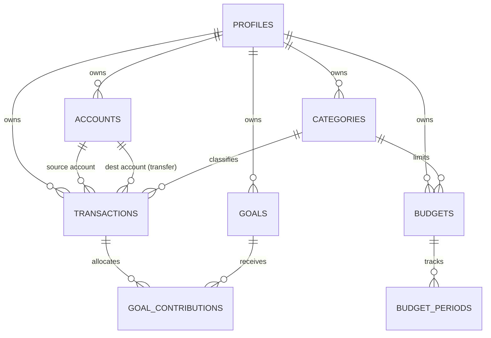

# Database Schema Documentation

## Personal Finance Tracker — Supabase / Postgres

**Version:** 1.0
**Status:** Draft
**Companion to:** SRS-personal-finance-app.md
**Date:** August 29, 2026

---

## 1. Overview

This document specifies the full Postgres schema for the application, intended to run on Supabase. It covers every table, column, constraint, index, and Row-Level Security (RLS) policy, along with the reasoning behind key structural decisions made during design.

All tables that hold user data are protected by RLS so that a user can only ever read or write their own rows. Authentication and the base `auth.users` table are provided natively by Supabase Auth; this document only covers application-owned tables.

---

## 2. Core Design Decisions

These decisions apply across the schema and are referenced throughout this document rather than repeated per table.

| Decision | Choice | Rationale |
|---|---|---|
| Monetary storage | Postgres `numeric` type (not integer minor units) | Native exact-decimal storage avoids floating-point rounding errors (NFR-2) without requiring manual cent-based math throughout the app. Application code must avoid ever casting amounts to a JS `Number`/float during calculation — use a decimal-safe library (e.g. `decimal.js`) or do the arithmetic in SQL. |
| Constrained "type" fields (`account.type`, `category.txn_type`, `transaction.type`, `budget.period_type`) | `text` + `CHECK` constraint, not native Postgres `enum` | Native enums require a schema migration (`ALTER TYPE`) to add a new value, which is awkward mid-development. `text` + `CHECK` gives the same validation guarantee with a simple constraint change. |
| Transactions modeling | Single `transactions` table with a `type` discriminator (`expense` / `income` / `transfer`) | Keeps all financial activity queryable from one place (e.g. "everything that happened on this account") rather than three tables that must be unioned. Transfer-only columns (`to_account_id`, `to_amount`, `exchange_rate`) are nullable and populated only when `type = 'transfer'`. |
| Goal-to-transaction relationship | Many-to-many via a `goal_contributions` junction table, not a `goal_id` column on `transactions` | A Goal is account-agnostic (can be funded from income logged against any account), and a single income transaction could in principle be split across more than one goal. A junction table supports this without overloading `transactions`. |
| Budget history | Two tables: `budgets` (the user's current rule) and `budget_periods` (a generated ledger of each period's actual numbers) | Editing a budget must not retroactively change past periods (FR-6.4), and rollover math (FR-6.3) needs a snapshot of each period's base limit, carried-over amount, and actual spend. Splitting these into two tables keeps "the rule" and "the history" independent. |
| Budget period generation | Lazily generated, not pre-scheduled | When a user opens a budget view, the app checks whether a `budget_periods` row exists covering the current date for that budget; if not, it computes and inserts one on the fly (using the most recent prior period to compute `rollover_in`). Avoids needing a cron job purely to keep period rows warm. |
| RLS strategy | Every table — including child tables — carries its own `user_id` column, denormalized where the "natural" owner is a grandparent | `goal_contributions` and `budget_periods` are reached via `goals`/`budgets` respectively, but RLS policies that require a join/subquery are slower and messier than a flat `user_id = auth.uid()` check. Denormalizing `user_id` onto every table keeps every RLS policy identical in shape and keeps the relevant index (`user_id`) directly on the table being filtered. |
| Account/Category deletion | Soft-delete (archive) for Accounts; hard-blocked deletion for Categories while referenced | Per SRS FR-2.3 and FR-4.4. Enforced at the application layer, backed by `ON DELETE RESTRICT` at the database level as a safety net (see §4). |
| Currency representation | `text`, 3-character ISO 4217 code (e.g. `PHP`, `USD`), validated against a curated list at the application layer | No dedicated `currencies` lookup table is needed for v1; a `CHECK (char_length(currency) = 3)` constraint guards against obviously malformed input at the DB level. |
| Category icons | `text` slug referencing the app's curated icon set (e.g. a Lucide icon name) | No icon lookup table; the curated ~50–100 icon list lives in application code/config, not the database. |
| Exchange rates | A single cache table storing one row per fetch, with all rates for that fetch stored as `jsonb` | Open Exchange Rates returns all currency pairs relative to one base currency (USD) in a single API call, so a per-pair table would be redundant. One row per daily fetch is simpler to cache and invalidate. |
| Goal contribution sum validation | Enforced at the application layer (not a DB trigger) | Verifying that the sum of a transaction's `goal_contributions` never exceeds its `amount` is a business rule that's straightforward to unit-test in application code and easy to get subtly wrong in a trigger. Revisit if data integrity issues surface in practice. |

---

## 3. Entity Relationship Diagram

`exchange_rates` is intentionally omitted from this diagram — it has no foreign-key relationship to any other table (see §4.9).

---

## 4. Tables

### 4.1 `profiles`

Extends `auth.users` with application-specific settings. One row per user, `id` shared with `auth.users.id`.

| Column | Type | Constraints | Notes |
|---|---|---|---|
| `id` | `uuid` | PK, FK → `auth.users(id)` `ON DELETE CASCADE` | Same value as the Supabase Auth user id. |
| `base_currency` | `text` | NOT NULL, `CHECK (char_length(base_currency) = 3)` | User's chosen display currency for dashboard aggregation. |
| `reminder_time` | `time` | NULLABLE | Time of day for the daily logging reminder (FR-10.2). Null = reminder not yet configured. |
| `reminder_enabled` | `boolean` | NOT NULL, DEFAULT `true` | Lets the user disable the reminder without losing the saved time. |
| `created_at` | `timestamptz` | NOT NULL, DEFAULT `now()` | |
| `updated_at` | `timestamptz` | NOT NULL, DEFAULT `now()` | |

**RLS policy:** `USING (id = auth.uid())` for SELECT/UPDATE. No DELETE policy — profile deletion happens via cascading `auth.users` deletion.

---

### 4.2 `accounts`

| Column | Type | Constraints | Notes |
|---|---|---|---|
| `id` | `uuid` | PK, DEFAULT `gen_random_uuid()` | |
| `user_id` | `uuid` | NOT NULL, FK → `profiles(id)` `ON DELETE CASCADE` | |
| `name` | `text` | NOT NULL | |
| `type` | `text` | NOT NULL, `CHECK (type IN ('cash','savings','e_wallet','custom'))` | Extend the CHECK list as new types are needed. |
| `currency` | `text` | NOT NULL, `CHECK (char_length(currency) = 3)` | ISO 4217 code. Immutable after creation — enforce via app logic (no UPDATE path exposes this column) and optionally a trigger that rejects changes. |
| `icon` | `text` | NULLABLE | Optional icon slug, same curated set as categories. |
| `color` | `text` | NULLABLE | Optional hex color override for UI display. |
| `archived_at` | `timestamptz` | NULLABLE | Non-null = archived (soft-deleted). Archived accounts are excluded from active views but retain full history. |
| `created_at` | `timestamptz` | NOT NULL, DEFAULT `now()` | |
| `updated_at` | `timestamptz` | NOT NULL, DEFAULT `now()` | |

**Indexes:** `(user_id)`, `(user_id, archived_at)` — the latter speeds up "active accounts only" queries.

**RLS policy:** `USING (user_id = auth.uid())` for all operations.

**Deletion behavior:** No hard-delete path exposed to users (FR-2.3). `ON DELETE RESTRICT` on any FK referencing `accounts.id` from `transactions` guards against accidental hard deletes at the DB level.

---

### 4.3 `categories`

| Column | Type | Constraints | Notes |
|---|---|---|---|
| `id` | `uuid` | PK, DEFAULT `gen_random_uuid()` | |
| `user_id` | `uuid` | NOT NULL, FK → `profiles(id)` `ON DELETE CASCADE` | |
| `name` | `text` | NOT NULL | |
| `txn_type` | `text` | NOT NULL, `CHECK (txn_type IN ('expense','income','transfer'))` | Scopes the category to one transaction type. |
| `icon` | `text` | NOT NULL | Slug referencing the curated icon set. |
| `is_default` | `boolean` | NOT NULL, DEFAULT `false` | Flags categories seeded at signup (FR-4.5), purely informational — defaults are still fully editable/deletable per user. |
| `created_at` | `timestamptz` | NOT NULL, DEFAULT `now()` | |

**Indexes:** `(user_id)`, `(user_id, txn_type)`.

**RLS policy:** `USING (user_id = auth.uid())` for all operations.

**Deletion behavior:** Blocked at the application layer while any `transactions.category_id` references the row (FR-4.4). `ON DELETE RESTRICT` on `transactions.category_id` backs this up at the DB level — an attempted hard delete while referenced will raise a foreign key violation rather than silently cascading.

---

### 4.4 `transactions`

The central table. One row per logged Expense, Income, or Transfer.

| Column | Type | Constraints | Notes |
|---|---|---|---|
| `id` | `uuid` | PK, DEFAULT `gen_random_uuid()` | |
| `user_id` | `uuid` | NOT NULL, FK → `profiles(id)` `ON DELETE CASCADE` | |
| `type` | `text` | NOT NULL, `CHECK (type IN ('expense','income','transfer'))` | |
| `account_id` | `uuid` | NOT NULL, FK → `accounts(id)` `ON DELETE RESTRICT` | Source account for all types; the account money leaves (transfer/expense) or enters (income). |
| `to_account_id` | `uuid` | NULLABLE, FK → `accounts(id)` `ON DELETE RESTRICT` | Only set when `type = 'transfer'`. |
| `category_id` | `uuid` | NOT NULL, FK → `categories(id)` `ON DELETE RESTRICT` | Category's `txn_type` should match this transaction's `type` — validated at the application layer (not practical to enforce via a plain FK/CHECK across tables). |
| `amount` | `numeric` | NOT NULL, `CHECK (amount > 0)` | In `account_id`'s currency. |
| `to_amount` | `numeric` | NULLABLE, `CHECK (to_amount IS NULL OR to_amount > 0)` | Only set for transfers; amount received in `to_account_id`'s currency. |
| `exchange_rate` | `numeric` | NULLABLE | Only set for cross-currency transfers; the rate applied at transaction time. |
| `txn_date` | `date` | NOT NULL | The date the transaction is logged against (may differ from `created_at` if backdated). |
| `note` | `text` | NULLABLE | |
| `client_created_at` | `timestamptz` | NOT NULL | Client-side timestamp, used for last-write-wins conflict resolution on offline sync (FR-9.4). |
| `synced_at` | `timestamptz` | NULLABLE | Null while the record only exists in an offline client queue; set once persisted to the server. |
| `created_at` | `timestamptz` | NOT NULL, DEFAULT `now()` | Server-side insert time. |
| `updated_at` | `timestamptz` | NOT NULL, DEFAULT `now()` | |

**Table-level CHECK constraints:**
- `CHECK ((type = 'transfer') = (to_account_id IS NOT NULL))` — transfers must have a destination account; non-transfers must not.
- `CHECK (to_account_id IS NULL OR to_account_id != account_id)` — a transfer can't target its own source account.

**Indexes:** `(user_id)`, `(account_id)`, `(to_account_id)`, `(category_id)`, `(user_id, txn_date)` — the last one supports the common "this user's transactions in a date range" query used throughout the analytics dashboard.

**RLS policy:** `USING (user_id = auth.uid())` for all operations.

---

### 4.5 `goals`

| Column | Type | Constraints | Notes |
|---|---|---|---|
| `id` | `uuid` | PK, DEFAULT `gen_random_uuid()` | |
| `user_id` | `uuid` | NOT NULL, FK → `profiles(id)` `ON DELETE CASCADE` | |
| `name` | `text` | NOT NULL | |
| `target_amount` | `numeric` | NOT NULL, `CHECK (target_amount > 0)` | Denominated in the user's base currency, since a Goal is account-agnostic and may be funded across accounts of differing currencies. |
| `target_date` | `date` | NULLABLE | |
| `created_at` | `timestamptz` | NOT NULL, DEFAULT `now()` | |

**Indexes:** `(user_id)`.

**RLS policy:** `USING (user_id = auth.uid())` for all operations.

**Deletion behavior:** Deleting a Goal removes the label only — it does not delete or modify the underlying `transactions` (FR-5.4). Its `goal_contributions` rows cascade-delete (see §4.6).

---

### 4.6 `goal_contributions`

Junction table linking Income transactions to the Goal(s) they fund.

| Column | Type | Constraints | Notes |
|---|---|---|---|
| `id` | `uuid` | PK, DEFAULT `gen_random_uuid()` | |
| `user_id` | `uuid` | NOT NULL, FK → `profiles(id)` `ON DELETE CASCADE` | Denormalized from the parent Goal/Transaction for RLS simplicity (see §2). |
| `goal_id` | `uuid` | NOT NULL, FK → `goals(id)` `ON DELETE CASCADE` | |
| `transaction_id` | `uuid` | NOT NULL, FK → `transactions(id)` `ON DELETE CASCADE` | |
| `amount` | `numeric` | NOT NULL, `CHECK (amount > 0)` | Portion of the transaction allocated to this goal. The sum of a transaction's contributions must not exceed its `amount` — validated at the application layer (see §2). |
| `created_at` | `timestamptz` | NOT NULL, DEFAULT `now()` | |

**Indexes:** `(user_id)`, `(goal_id)`, `(transaction_id)`.

**RLS policy:** `USING (user_id = auth.uid())` for all operations.

---

### 4.7 `budgets`

The user's current budgeting rule per category. Represents "what should happen going forward," not historical actuals.

| Column | Type | Constraints | Notes |
|---|---|---|---|
| `id` | `uuid` | PK, DEFAULT `gen_random_uuid()` | |
| `user_id` | `uuid` | NOT NULL, FK → `profiles(id)` `ON DELETE CASCADE` | |
| `category_id` | `uuid` | NOT NULL, FK → `categories(id)` `ON DELETE RESTRICT` | |
| `limit_amount` | `numeric` | NOT NULL, `CHECK (limit_amount > 0)` | The base limit before rollover adjustment. |
| `period_type` | `text` | NOT NULL, `CHECK (period_type IN ('weekly','monthly','custom'))` | |
| `start_date` | `date` | NOT NULL | Anchor date for weekly/monthly cycles, or the start of a one-off custom period. |
| `end_date` | `date` | NULLABLE | Only set (and required) when `period_type = 'custom'`. |
| `created_at` | `timestamptz` | NOT NULL, DEFAULT `now()` | |
| `updated_at` | `timestamptz` | NOT NULL, DEFAULT `now()` | Edits take effect from the current period forward only (FR-6.4) — past `budget_periods` rows are not recalculated retroactively. |

**Table-level CHECK constraint:** `CHECK ((period_type = 'custom') = (end_date IS NOT NULL))`.

**Indexes:** `(user_id)`, `(category_id)`.

**RLS policy:** `USING (user_id = auth.uid())` for all operations.

---

### 4.8 `budget_periods`

A generated, append-only ledger of each concrete period a budget has gone through. Rows are created lazily (see §2), not pre-scheduled.

| Column | Type | Constraints | Notes |
|---|---|---|---|
| `id` | `uuid` | PK, DEFAULT `gen_random_uuid()` | |
| `user_id` | `uuid` | NOT NULL, FK → `profiles(id)` `ON DELETE CASCADE` | Denormalized from the parent Budget for RLS simplicity (see §2). |
| `budget_id` | `uuid` | NOT NULL, FK → `budgets(id)` `ON DELETE CASCADE` | |
| `period_start` | `date` | NOT NULL | |
| `period_end` | `date` | NOT NULL | |
| `base_limit` | `numeric` | NOT NULL | Snapshot of `budgets.limit_amount` at the time this period was generated — insulates this row from later edits to the parent budget. |
| `rollover_in` | `numeric` | NOT NULL, DEFAULT `0` | Carried surplus (positive) or deficit (negative) from the immediately prior period, per FR-6.3. |
| `effective_limit` | `numeric` | NOT NULL | Computed as `base_limit + rollover_in` at generation time and stored (not a generated column), since it's a point-in-time snapshot. |
| `actual_spent` | `numeric` | NOT NULL, DEFAULT `0` | Running total of spend against this category within `[period_start, period_end]`; updated as transactions are logged. |
| `created_at` | `timestamptz` | NOT NULL, DEFAULT `now()` | |

**Table-level constraint:** `UNIQUE (budget_id, period_start)` — prevents lazy generation from ever creating a duplicate period.

**Indexes:** `(user_id)`, `(budget_id)`.

**RLS policy:** `USING (user_id = auth.uid())` for all operations.

---

### 4.9 `exchange_rates`

A simple daily cache of Open Exchange Rates data. Not user-scoped — shared across all users, no RLS needed beyond default-deny for writes (only a server-side job/service role should insert into this table).

| Column | Type | Constraints | Notes |
|---|---|---|---|
| `id` | `uuid` | PK, DEFAULT `gen_random_uuid()` | |
| `base_currency` | `text` | NOT NULL, DEFAULT `'USD'` | The currency all rates in this row are relative to (Open Exchange Rates' free tier fixes this to USD). |
| `rates` | `jsonb` | NOT NULL | Map of `{ "PHP": 56.2, "EUR": 0.91, ... }` for the fetch. |
| `fetched_at` | `timestamptz` | NOT NULL, DEFAULT `now()` | |

**Indexes:** `(fetched_at DESC)` — supports "get the latest cached rates" as the primary access pattern.

**RLS policy:** RLS enabled with no policies for `authenticated`/`anon` roles beyond SELECT (read-only for the app); inserts happen via a service-role key from a scheduled server-side job, bypassing RLS.

---

## 5. Relationship Summary

| Parent | Child | Cardinality | On Delete |
|---|---|---|---|
| `profiles` | `accounts` | 1 → many | CASCADE |
| `profiles` | `categories` | 1 → many | CASCADE |
| `profiles` | `transactions` | 1 → many | CASCADE |
| `profiles` | `goals` | 1 → many | CASCADE |
| `profiles` | `budgets` | 1 → many | CASCADE |
| `accounts` | `transactions.account_id` | 1 → many | RESTRICT |
| `accounts` | `transactions.to_account_id` | 1 → many | RESTRICT |
| `categories` | `transactions` | 1 → many | RESTRICT |
| `categories` | `budgets` | 1 → many | RESTRICT |
| `transactions` | `goal_contributions` | 1 → many | CASCADE |
| `goals` | `goal_contributions` | 1 → many | CASCADE |
| `budgets` | `budget_periods` | 1 → many | CASCADE |

`RESTRICT` relationships back up application-level rules that already prevent the delete from being offered in the UI (archiving Accounts, blocking Category deletion). `CASCADE` relationships are used where the child row has no independent meaning once its parent is gone (a contribution without its transaction or goal, a period without its budget).

---

## 6. Resolved Schema Decisions

The following were originally open questions and have since been resolved; kept here for traceability.

1. **Category/transaction type consistency** — confirmed: enforced at the application layer only. No cross-table CHECK or trigger is added for this.
2. **Account currency immutability enforcement** — confirmed: relying on the application never exposing an UPDATE path for `accounts.currency` is sufficient. No database trigger needed.
3. **`exchange_rates` retention** — confirmed: no cleanup/expiry policy needed for v1. The table can grow indefinitely at roughly one row per day; retention can be revisited later if it becomes an issue.
